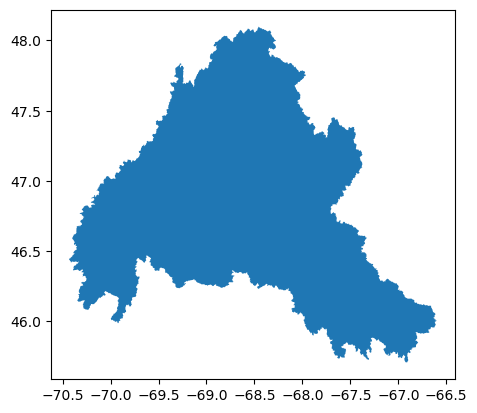

As climate change is on the rise wildfire are becoming more frequent. The report from the Trump administration said that the warmer our country gets the more combustible it will be, and that with continued release of greenhouse gases fires will be more frequent. Fires may no longer just be a Western United States problem but a national problem. We know this because we have already seen increased burning in the West from dryer forests, warmer summers resulting in less snow, droughts, and by looking at human behavior where people are increasingly intruding into wildland areas. Unfortunately, this will only worsen climate change as fires increase carbon emissions setting off a deadly positive feedback loop.

Pierre-louis, K., &amp; Popovich, N. (2018, November 27). Climate change is fueling wildfires nationwide, New Report warns. The New York Times. https://www.nytimes.com/interactive/2018/11/27/climate/wildfire-global-warming.html 

The national hydrography dataset (NHD) represents water drainage networks in the United States. This includes features such as rivers, streams, canals, lakes, ponds, streamgages, etc. This dataset includes line, area, and point features. It is typically mapped at 1:24,000 scale or larger and maintained through Stweardship partnerships. It is available as a geodatabase and shapfile. The geodatabase maintains detailed features while a shapefile simplifies its structure. 

National Hydrography Dataset. National Hydrography Dataset | U.S. Geological Survey. (n.d.). https://www.usgs.gov/national-hydrography/national-hydrography-dataset 

### National Hydrology (HU4) area

    <Axes: >

    

    

The data contains spatial database of wildfires in the United States from 1992 to 2020. It was acquired from the reporting systems from federal, state, and local fire organizations. It required discovery date, final fire size, and a point location at least as precise and 1-square mile grid. It also had basic error checking and cleaning for repeat records which results in 2.3 million wildfire records. 

Fires data:

    fire_gdf does not exsist. Loading...

<table border="1" class="dataframe">
  <thead>
    <tr style="text-align: right;">
      <th></th>
      <th>FOD_ID</th>
      <th>FPA_ID</th>
      <th>SOURCE_SYSTEM_TYPE</th>
      <th>SOURCE_SYSTEM</th>
      <th>NWCG_REPORTING_AGENCY</th>
      <th>NWCG_REPORTING_UNIT_ID</th>
      <th>NWCG_REPORTING_UNIT_NAME</th>
      <th>SOURCE_REPORTING_UNIT</th>
      <th>SOURCE_REPORTING_UNIT_NAME</th>
      <th>LOCAL_FIRE_REPORT_ID</th>
      <th>...</th>
      <th>FIRE_SIZE</th>
      <th>FIRE_SIZE_CLASS</th>
      <th>LATITUDE</th>
      <th>LONGITUDE</th>
      <th>OWNER_DESCR</th>
      <th>STATE</th>
      <th>COUNTY</th>
      <th>FIPS_CODE</th>
      <th>FIPS_NAME</th>
      <th>geometry</th>
    </tr>
  </thead>
  <tbody>
    <tr>
      <th>0</th>
      <td>1</td>
      <td>FS-1418826</td>
      <td>FED</td>
      <td>FS-FIRESTAT</td>
      <td>FS</td>
      <td>USCAPNF</td>
      <td>Plumas National Forest</td>
      <td>0511</td>
      <td>Plumas National Forest</td>
      <td>1</td>
      <td>...</td>
      <td>0.10</td>
      <td>A</td>
      <td>40.036944</td>
      <td>-121.005833</td>
      <td>USFS</td>
      <td>CA</td>
      <td>63</td>
      <td>06063</td>
      <td>Plumas County</td>
      <td>POINT (-121.00582 40.03694)</td>
    </tr>
    <tr>
      <th>1</th>
      <td>2</td>
      <td>FS-1418827</td>
      <td>FED</td>
      <td>FS-FIRESTAT</td>
      <td>FS</td>
      <td>USCAENF</td>
      <td>Eldorado National Forest</td>
      <td>0503</td>
      <td>Eldorado National Forest</td>
      <td>13</td>
      <td>...</td>
      <td>0.25</td>
      <td>A</td>
      <td>38.933056</td>
      <td>-120.404444</td>
      <td>USFS</td>
      <td>CA</td>
      <td>61</td>
      <td>06061</td>
      <td>Placer County</td>
      <td>POINT (-120.40443 38.93305)</td>
    </tr>
    <tr>
      <th>2</th>
      <td>3</td>
      <td>FS-1418835</td>
      <td>FED</td>
      <td>FS-FIRESTAT</td>
      <td>FS</td>
      <td>USCAENF</td>
      <td>Eldorado National Forest</td>
      <td>0503</td>
      <td>Eldorado National Forest</td>
      <td>27</td>
      <td>...</td>
      <td>0.10</td>
      <td>A</td>
      <td>38.984167</td>
      <td>-120.735556</td>
      <td>STATE OR PRIVATE</td>
      <td>CA</td>
      <td>17</td>
      <td>06017</td>
      <td>El Dorado County</td>
      <td>POINT (-120.73554 38.98416)</td>
    </tr>
    <tr>
      <th>3</th>
      <td>4</td>
      <td>FS-1418845</td>
      <td>FED</td>
      <td>FS-FIRESTAT</td>
      <td>FS</td>
      <td>USCAENF</td>
      <td>Eldorado National Forest</td>
      <td>0503</td>
      <td>Eldorado National Forest</td>
      <td>43</td>
      <td>...</td>
      <td>0.10</td>
      <td>A</td>
      <td>38.559167</td>
      <td>-119.913333</td>
      <td>USFS</td>
      <td>CA</td>
      <td>3</td>
      <td>06003</td>
      <td>Alpine County</td>
      <td>POINT (-119.91332 38.55916)</td>
    </tr>
    <tr>
      <th>4</th>
      <td>5</td>
      <td>FS-1418847</td>
      <td>FED</td>
      <td>FS-FIRESTAT</td>
      <td>FS</td>
      <td>USCAENF</td>
      <td>Eldorado National Forest</td>
      <td>0503</td>
      <td>Eldorado National Forest</td>
      <td>44</td>
      <td>...</td>
      <td>0.10</td>
      <td>A</td>
      <td>38.559167</td>
      <td>-119.933056</td>
      <td>USFS</td>
      <td>CA</td>
      <td>3</td>
      <td>06003</td>
      <td>Alpine County</td>
      <td>POINT (-119.93304 38.55916)</td>
    </tr>
  </tbody>
</table>

5 rows × 38 columns

    /opt/conda/lib/python3.10/site-packages/geopandas/geodataframe.py:206: UserWarning: Pandas doesn't allow columns to be created via a new attribute name - see https://pandas.pydata.org/pandas-docs/stable/indexing.html#attribute-access
      super().__setattr__(attr, val)

         column_name                  ylabel                                 title
    0  max_fire_size  Fire Size (million ha)  Largest fire on record in the region
    1      num_fires         Number of Fires   Total number of fires in the region

    /opt/conda/lib/python3.10/site-packages/holoviews/core/util.py:1175: FutureWarning: unique with argument that is not not a Series, Index, ExtensionArray, or np.ndarray is deprecated and will raise in a future version.
      return pd.unique(values)
    /opt/conda/lib/python3.10/site-packages/holoviews/core/util.py:1175: FutureWarning: unique with argument that is not not a Series, Index, ExtensionArray, or np.ndarray is deprecated and will raise in a future version.
      return pd.unique(values)
    /opt/conda/lib/python3.10/site-packages/holoviews/core/data/pandas.py:39: FutureWarning: Series.__getitem__ treating keys as positions is deprecated. In a future version, integer keys will always be treated as labels (consistent with DataFrame behavior). To access a value by position, use `ser.iloc[pos]`
      return dataset.data.dtypes[idx].type
    /opt/conda/lib/python3.10/site-packages/holoviews/core/data/pandas.py:39: FutureWarning: Series.__getitem__ treating keys as positions is deprecated. In a future version, integer keys will always be treated as labels (consistent with DataFrame behavior). To access a value by position, use `ser.iloc[pos]`
      return dataset.data.dtypes[idx].type
    /opt/conda/lib/python3.10/site-packages/holoviews/core/data/pandas.py:39: FutureWarning: Series.__getitem__ treating keys as positions is deprecated. In a future version, integer keys will always be treated as labels (consistent with DataFrame behavior). To access a value by position, use `ser.iloc[pos]`
      return dataset.data.dtypes[idx].type
    /opt/conda/lib/python3.10/site-packages/holoviews/core/data/pandas.py:39: FutureWarning: Series.__getitem__ treating keys as positions is deprecated. In a future version, integer keys will always be treated as labels (consistent with DataFrame behavior). To access a value by position, use `ser.iloc[pos]`
      return dataset.data.dtypes[idx].type
    /opt/conda/lib/python3.10/site-packages/holoviews/plotting/bokeh/plot.py:987: UserWarning: found multiple competing values for 'toolbar.active_drag' property; using the latest value
      layout_plot = gridplot(
    /opt/conda/lib/python3.10/site-packages/holoviews/plotting/bokeh/plot.py:987: UserWarning: found multiple competing values for 'toolbar.active_scroll' property; using the latest value
      layout_plot = gridplot(

    BokehModel(combine_events=True, render_bundle={'docs_json': {'2968439c-1a9f-476c-bb81-2ce5707391e5': {'version…

### Fire Density Plot 
This plot shows us the fire densities in the National Hydrography dataset region. Because the region is fairly small the densities are all very similar but if we were to be looking at a bigger study area we may see more variety of colors. The density is somewhere between 508.5 to 508.  

  

    [NbConvertApp] Converting notebook vector.ipynb to markdown
    /opt/conda/share/jupyter/nbconvert/templates/base/display_priority.j2:32: UserWarning: Your element with mimetype(s) dict_keys(['application/javascript', 'application/vnd.holoviews_load.v0+json']) is not able to be represented.
      
    /opt/conda/share/jupyter/nbconvert/templates/base/display_priority.j2:32: UserWarning: Your element with mimetype(s) dict_keys([]) is not able to be represented.
      
    [NbConvertApp] Support files will be in vector_files/
    [NbConvertApp] Writing 29578 bytes to vector.md

